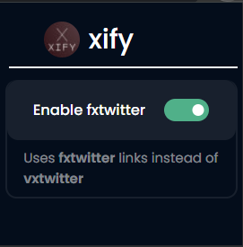
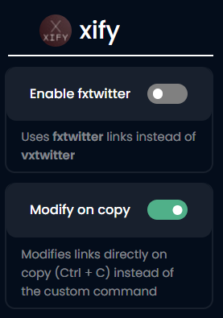

## What is this?

xify - a chrome/firefox extension that changes twitter links to vxtwitter/fxtwitter links automatically.

## Why?

Coz the twitter embeds failed the tenth time this week and I'm too lazy to manually edit links to vxtwitter everytime I share art on discord.

## How to use?

### On Chrome

1. Install the extension from [chrome web store](https://chrome.google.com/webstore/detail/xify/cihieeigmpndggpojmhjndlgjdmlgaoe).
2. Go to any twitter.com link and use `Ctrl+Shift+K` (or `Ctrl+C` if you enable `modify on copy`) shortcut.
3. And that's it, the extension will automatically change the url to `vxtwiiter.com`/`fxtwiiter.com` link.

### On Firefox

1. Install the extension from [here](https://addons.mozilla.org/en-US/firefox/addon/xify/).
2. Go to any twitter.com link and use `Ctrl+Alt+K` (or `Ctrl+C` if you enable `modify on copy`) shortcut.
3. And that's it, the extension will automatically change the url to `vxtwiiter.com`/`fxtwiiter.com` link.

### How to switch between vxtwitter and fxtwitter?

By default the extension uses `vxtwitter` links. You can enable the option `Enable fxtwitter` from the extension popup to use `fxtwitter` links instead of `vxtwitter`.

### How to get modified links on copy (`Ctrl + C`) shortcut directly?

By default, the extension only modifies links on custom shortuct (`Ctrl+Shift+K`/`Ctrl+Alt+K`). You can enable the option `modify on copy` from the extension popup to let the bot use modified links on copy shortuct (`Ctrl+C`) directly.

## License

xify is licensed under [MIT License](https://github.com/thevenuz/xify/blob/master/LICENSE).
